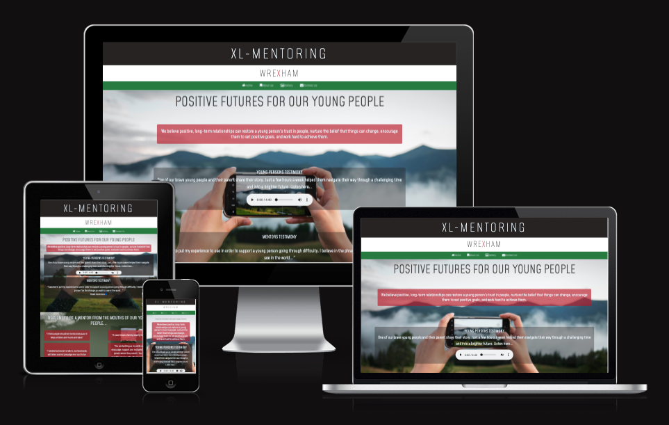
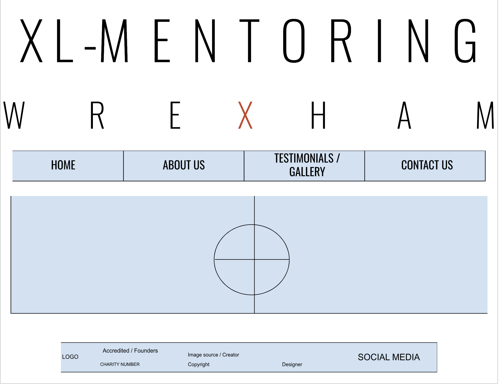
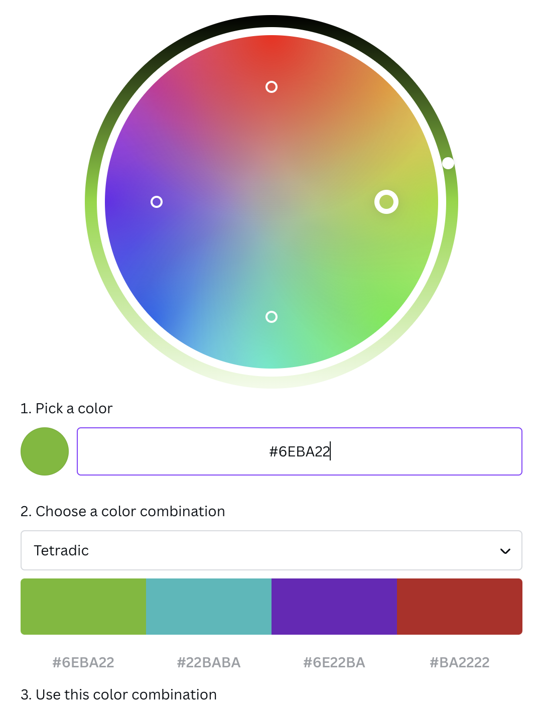
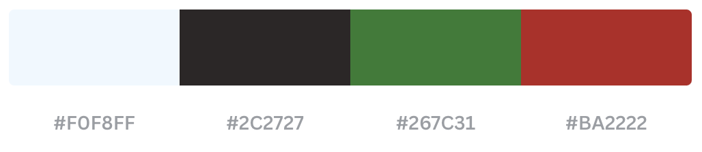

# XL-MENTORING-WREXHAM - ReadME

[Access the live site here.](**************)

This is the documentation for the XL-Mentoring, Wrexham website. The site has been built using HTML5 & CSS3 with minor javascript elements created through the use of Bootstrap for the Milestone 1 project for Code Institute's web development diploma.

******

## Contents

* [User Experience (UX)](#user-experience---ux)
  * [Strategy](#strategy)
    * [User Stories](#user-stories)
  * [Scope](#scope)
  * [Structure](#structure)
  * [Skeleton](#skeleton)
* [User Interface (UI) Design](#user-interface---design)
  * [Typography](#typography)
  * [Colours](#colours)
* [Features](#features)
  * [Site-Wide](#site-wide)
  * [Home Page](#home-page)
  * [Gallery](#gallery)
  * [Contact](#contact)
* [Future Implementations](#future-implementations)
* [Accessibility](#accessibility)
  * [Alt Text](#alt-text)
  * [Aria Labels](#aria-labels)
  * [Colours](#colours-1)
  * [Fonts](#fonts)
* [Technologies Used](#technologies-used)
  * [Languages](#languages)
  * [Frameworks, Libraries, and Programs Used](#frameworks-libraries-and-programs-used)
* [Deployment & Local Development](#deployment--local-development)
  * [Deployment](#deployment)
  * [Local Development](#local-development)
    * [How to Fork](#how-to-fork)
    * [How to Clone](#how-to-clone)
* [Testing](#testing)
* [Credits](#credits)
  * [Code Used](#code-used)
  * [Content](#content)
  * [Media](#media)
  * [Achnowledgements](#acknowledgements)

[*Back to top*](#contents)

-----

## User Experience - UX

### Strategy

 This project is inspired by a real charity that exists in Wrexham, Wales The aim of the website is to broaden the oportunities to recruit volunteers. The charity doesn't have a shortage of young people being referred but has a shortage of volunteer mentors. The Project Manager is mindful that parents, guardians, teachers and young people will have access to this sight. With this in mind it needs to be informative without it being academically out of reach for people who might struggle. Images to describe the journey and process were considered to be key.
 
#### User Stories

* __First Time Visitor Goals__

    a. As a first time visitor, I want to be able to easily understand the purpose of the website and to learn more about the charity.

    b. As a first time visitor, I want to be able to easily navigate the site to access content without having to use the back button at any time.

    c. As a first time visitor, I want to look for testimonials to understand the benefits of the charity to young people. I also want to locate their social media links to see their followings on social media to determine how trusted and how well known they are.

* __Returning Visitor Goals__

    a. As a returning visitor, I want to be able to find infomation easily to show others.

    b. As a returning visitor, I want to know how to contact the business for more information.

* __Frequent User Goals__

    a. As a frequent user, I want to confidently recommend the charity to others.
    
    b. As a frequent visitor, I want to be able to check for new traing days and discover what current opportunities the charity has had.

[*Back to top*](#contents)

### Scope

Taking all of the above into account I decided that we would need four main pages to begin with;

* __Home Page:__ This would provide users with charities motto along with some testimonials from young people who have benefited from the charity
* __About Us Page:__ This would provide crucial information covering who its for, who can volunteer,how it works and safeguarding
* __Gallery & Media Page:__ This would showcase some of the charities events, recognitions and links to magazines articles.
* __Contact Page:__ This would allow users to ask for more information and to show interest.

As well as the four main pages, links to the charities social media page, charity registration number and accreditations  would be clearly shown in the footer to direct users to other sites.

These four pages give the Project Manager a good starting idea about the potential for having their own website with room to expand the site to include more features in the future.

[*Back to top*](#contents)

-----

### Structure

The navigation route will be linear and will encourage users to go on a journey to learn about the work the charity does, the benefits to young people, read about the charity, view some of the events and past accolades and then opportunity to contact the charity for more information. This will be the order that the pages appear in the navigation bar.

[*Back to top*](#contents)

-----

### Skeleton

#### Wireframes

XL-Mentoring, Wrexham - Wireframes

All wireframes have been created with using a basic drawing add -on on Google Docs

The wireframes featured here are the initial design idea for the webpage. Some styling elements have been changed since the wireframes were drawn because we used different images which we felt were more modern. For example: instead of using two images with a young boy and girl looking through a telscope we chose to use one image of a mobile phone being held to take a picture of the view of the mountains before they go on a hike.

[*Back to top*](#contents)

## User Interface - Design

### Surface

#### Typography

Fonts have been imported from [Google Fonts](https://fonts.google.com/).

* [Alumni Sans Pinstripe](https://fonts.google.com/specimen/Alumni+Sans+Pinstripe?query=pinstripe) This font has been used for the header as it was the nearest to the current XL-Mentoring Logo. Mohave is the fallback font followed by Sans Serif. We chose this style of font as it was the nearest to what is currently used for the logo and it keeps the continuity and identity of the charity.

* [Mohave](https://fonts.google.com/specimen/Mohave?query=mohave) This font has been used for the main text across the site with "sans-serif" as fallback if the browser doesn't import the font correctly. We felt this was more readable than the above Alumni Sans Pinstripe but a a very similar style. We didn't want to have too many different fonts as it can make the webpage look too busy.

#### Colours

Initial colourscheme ideas through Canva

I used [Canva](https://www.canva.com/colors/color-wheel/) to research a colourscheme for the site. Based on the overview of the site I knew we wanted to include colors which reflected the outdoors and at the same time the welsh red and green.

Main colour scheme for the site

* __#BA2222__ is the colour I chose for the "X" in Wrexham in the header. We thought it symbolised the welsh dragon above the green navigation bar giving it a sophisticated look. I also used an opaque version to for some of the backgroud text boxes. 

* __#267C31__ - This forest green is the colour I chose for the navigation bar as I felt it was an outdoor countryside green which complimented the images I've used and it was a good representation for the welsh flag. 

* __#2C2727__ - This charcoal-grey color I chose as it was softer on the eyes compared to a definite black which was used in the footer, header text, shadows and also an opaque version was used for the boxes that contained links.

* __#F0F8FF__ - Also known as Aliceblue, this color was used for the text boxes. I felt it was a good contrast to the background box colors above but softer than a harsh white.

[*Back to top*](#contents)

-------

## Features

### Site-Wide

Desktop Header

 

Mobile Header

 

On larger screens the header's logo title sits at the left of the navbar and the navigation links sit on the right as HOME | GALLERY | CONTACT. On smaller screens the logo and links are pushed to the middle of the screen with the logo on top and icons representing each of the links sitting below.

The navigation links on each page have an animated underline feature that expands from the left when hovered over and contracts to the right when the focus is removed.

Desktop Footer

Mobile Footer

On larger screens the copyright information shows the copyright icon followed by "Folded Fairy 2023" to the left of the footer bar. On the right of the footer there are three socials icons for FACEBOOK | INSTRGRAM | PINTEREST. This layout remains relatively similar on smaller screens with only the copyright symbol appearing on the left.

Hero Image Fade-in Animation

On the home and contact pages the hero image fades into view over 4 seconds using a keyframes animation. This has also been applied to the gallery carousel as the page loads.
