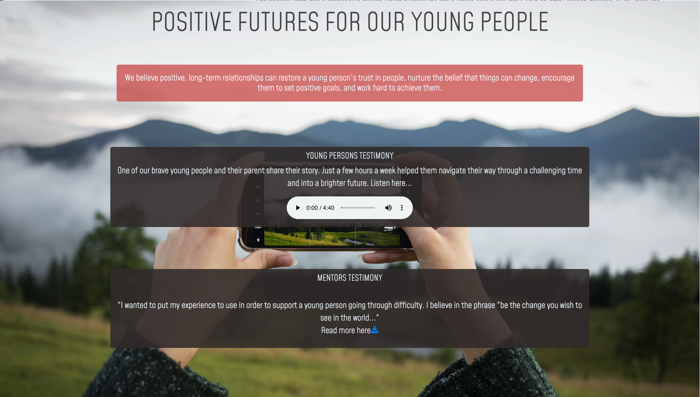

# XL-MENTORING-WREXHAM - ReadME

[Access the live site here.](**************)

This is the documentation for the XL-Mentoring, Wrexham website. The site has been built using HTML5 & CSS3 with minor javascript elements created through the use of Bootstrap for the Milestone 1 project for Code Institute's web development diploma.

******

## Contents

- [XL-MENTORING-WREXHAM - ReadME](#xl-mentoring-wrexham---readme)
  - [Contents](#contents)
  - [User Experience - UX](#user-experience---ux)
    - [Strategy](#strategy)
      - [User Stories](#user-stories)
    - [Scope](#scope)
    - [Structure](#structure)
    - [Skeleton](#skeleton)
      - [Wireframes](#wireframes)
  - [User Interface - Design](#user-interface---design)
    - [Surface](#surface)
      - [Typography](#typography)
      - [Colours](#colours)
  - [Features](#features)
    - [Site-Wide](#site-wide)
    - [Home Page](#home-page)
    - [Contact](#contact)
  - [Future Implementations](#future-implementations)
  - [Accessibility](#accessibility)
    - [Alt Text](#alt-text)
    - [Aria Labels](#aria-labels)
    - [Fonts](#fonts)
    - [Frameworks, Libraries, and Programs Used](#frameworks-libraries-and-programs-used)
  - [Deployment \& Local Development](#deployment--local-development)
    - [Deployment](#deployment)
    - [Local Development](#local-development)
  - [Testing](#testing)
    - [Media](#media)
    - [Acknowledgements](#acknowledgements)

[*Back to top*](#contents)

-----

## User Experience - UX

### Strategy

 This project is inspired by a real charity that exists in Wrexham, Wales. The aim of the website is to broaden the opportunities to recruit volunteers. The charity doesn't have a shortage of young people being referred to by schools but has a shortage of volunteer mentors. The Project Manager is mindful that parents, guardians, teachers and young people will have access to this sight. With this in mind it needs to be informative without it being academically out of reach for people who might struggle. Images to describe the journey and process were considered to be key. So it was requested that a hiking journey would be appropriate as we are surrounded by hills and Snowdonia is nearby. 
 
#### User Stories

* __First Time Visitor Goals__

    a. As a first time visitor, I want to be able to easily understand the purpose of the website and to learn more about the charity.

    b. As a first time visitor, I want to be able to easily navigate the site to access content without having to use the back button at any time.

    c. As a first time visitor, I want to look for testimonials to understand the benefits of the charity to young people. I also want to locate the charities social media links to see their followings on social media to determine how trusted and how well known they are.

* __Returning Visitor Goals__

    a. As a returning visitor, I want to be able to find infomation easily to show others.

    b. As a returning visitor, I want to know how to contact the business for more information.

* __Frequent User Goals__

    a. As a frequent user, I want to confidently recommend the charity to others.
    
    b. As a frequent visitor, I want to be able to check for new training days and discover what current opportunities the charity has had.

[*Back to top*](#contents)

### Scope

Taking all of the above into account I decided that we would need three main pages to begin with;

* __Home Page:__ This would provide users with charities motto along with some testimonials from young people who have benefited from the charity
* __About Us Page:__ This would provide crucial information covering who its for, who can volunteer, how it works and safeguarding
* __Contact Page:__ This would allow users to ask for more information and to show interest.

As well as the three main pages, links to the charities social media page, charity registration number and accreditations  would be clearly shown in the footer to direct users to other sites.

These three pages give the Project Manager a good starting idea about the potential for having their own website with room to expand the site to include more features in the future.

[*Back to top*](#contents)

-----

### Structure

The navigation route will be linear and will encourage users to go on a journey to learn about the work the charity does, the benefits to young people and then opportunity to contact the charity for more information. This will be the order that the pages appear in the navigation bar.

[*Back to top*](#contents)

-----

### Skeleton

#### Wireframes

XL-Mentoring, Wrexham - Wireframes

All wireframes have been created with using a basic drawing add -on on Google Docs

The wireframes featured here are the initial design idea for the webpage. Some styling elements have been changed since the wireframes were drawn because we used different images which we felt were more modern. For example: instead of using two images with a young boy and girl looking through a telscope we chose to use one image of a mobile phone being held to take a picture of the view of the mountains before they go on a hike.

[*Back to top*](#contents)

## User Interface - Design

### Surface

#### Typography

Fonts have been imported from [Google Fonts](https://fonts.google.com/).

* [Alumni Sans Pinstripe](https://fonts.google.com/specimen/Alumni+Sans+Pinstripe?query=pinstripe) This font has been used for the header as it was the nearest to the current XL-Mentoring Logo. Mohave is the fallback font followed by Sans Serif. We chose this style of font as it was the nearest to what is currently used for the logo and it keeps the continuity and identity of the charity.

* [Mohave](https://fonts.google.com/specimen/Mohave?query=mohave) This font has been used for the main text across the site with "sans-serif" as fallback if the browser doesn't import the font correctly. We felt this was more readable than the above Alumni Sans Pinstripe but a a very similar style. We didn't want to have too many different fonts as it can make the webpage look too busy.

#### Colours

Initial colour scheme ideas through Canva

I used [Canva](https://www.canva.com/colors/color-wheel/) to research a colourscheme for the site. Based on the overview of the site I knew we wanted to include colors which reflected the outdoors and at the same time the welsh red and green which is important to this area.

Main colour scheme for the site

* __#BA2222__ is the colour I chose for the "X" in Wrexham in the header. We thought it symbolised the welsh dragon above the green navigation bar giving it a sophisticated look. I also used an opaque version for some of the backgroud text boxes. 

* __#267C31__ - This forest green is the colour I chose for the navigation bar as I felt it was an outdoor countryside green which complimented the images I've used and it was a good representation for the welsh flag. 

* __#2C2727__ - This charcoal-grey color I chose is softer on the eyes compared to a definite black. The charcoal grey used in the footer, header text, shadows and also an opaque version was used for the boxes that contained links.

* __#F0F8FF__ - Also known as Aliceblue, this color was used for the text in boxes. I felt it was a good contrast to the background box colors above but softer than a harsh white.

[*Back to top*](#contents)

-------

## Features

### Site-Wide

Desktop Header

 

Mobile Header

 

As XL-mentoring already has merchandise with "XL-Mentoring" written on the items with a particular style I wanted to keep the brand identity on the website. Also the reason the color green was chosen for the navigation bar with the red x in Wrexham was to show welsh loyalty which is important in Wales. I decided to centralise the header to keep it symmetrical and draw people eyes to the middle of the screen where key testimonies can be found. The listed navigation links all have animation to help the user know when they are hovering over the link correctly.
This layout also works well on mobile and smaller screens.

Desktop Footer

Mobile Footer

On larger screens the footer is horizontal and with a easily readable size font. It was felt by the client that the footer wasn't to be an advertising placard so we kept it subtle. On mobile screens the footer changes direction and becomes vertical.

Hero Image

On the home page the hero image is of a person taking a picture of the mountain landscape before going on a hike. This was chosen to suggest that users were going on a journey. It was also felt that the mobile phone appealed to a wider demographic.

### Home Page

Home Page

The homepage has a person taking a mountain view with a mobile phone. On-top of this is two links. One being an audio testimony from a young person and the second being a pdf written testimony from a mentor to be downloaded.
The home-page also has the charities motto. Further down are other testimonies from young people.

Responsive About Us section

Using bootstrap's grid styling and card classes, the About Us page has a responsive layout that changes for three different breakpoints. On large screens the image goes to the left of the screen and the textboxes are standing on the right. For medium to small size screens the text boxes sit on top of the image so you can still see the dramatic scenery. This is different from my original plan of having a circle to represent the view from binoculars and text being in the four quadrants of the circle.

### Contact

Responsive Contact Form

FormDump

The Contact page has a responsize design. The image sits to the left of the form and the picture shows a person who has reached the top of the mountain. All fields have to be filled in for the Submit button to work. In all fields the words "Required" are also visible so the user knows what is needed.

[*Back to top*](#contents)

## Future Implementations

1. A gallery was planned to be added with addition of media links to highlight the media profile the charity has.

2. A Welsh translation is being considered but is on hold as the Project Manager doesn't speak Welsh and we didn't want users to expect a welsh speaker at the end of the phone or email.

3. A page designated to who the Project Manager is, so users don't feel they are sharing information with an Artifical Intelligence.

4. Address some of the gaps when viewing on larger screens and consider including another page so some of the pages appear less cramped which would make it look less busy. 

[*Back to top*](#contents)

## Accessibility

### Alt Text

Alternative text has been included for all images across the site, including all images within the readme file.

### Aria Labels

Aria labels have been included for all links across the site, as well as the copyright icon in the footer.

### Fonts

The main font is plain and easy to read. The cursive font used for the main heading and various sections throughout has been styled with extra letter spacing to make it easier to read.

[*Back to top*](#contents)

### Frameworks, Libraries, and Programs Used

- [Bootstrap V4.3](https://getbootstrap.com/docs/4.3/getting-started/introduction/) - For the framework for the website. Code for the navigation bar, About Us, Contacts Us were used and modified. Additional CSS styling was also implemented in style.css.

* Google docs - The draw and paint utilities were used for wireframes and other graphics in readme.

- [Font Awesome](https://fontawesome.com/v4/) - For the icons on the website.

* Git - For version control.

* [Github](https://github.com/) - To save and store the files for the website.

* Google Dev Tools - To troubleshoot and test features, solve issues with responsiveness and styling.

* [Google Fonts](https://fonts.google.com/) - To import the fonts used on the website.

- [Freepik](https://www.freepik.com/) - For stock image.

* [UI.dev](https://ui.dev/amiresponsive) - To show the site on a range of screen sizes.

[*Back to top*](#contents)

-------

## Deployment & Local Development

### Deployment

Github Pages was used to deploy the live website. The instructions to achieve this are below:

1. Log in (or sign up) to [Github](https://github.com/).
2. Find the repository for this project, [xlmentoringwxh](https://github.com/bencooperjamin/xlmentoringwxh).
3. Click on the Settings link.
4. Click on the Pages link in the left hand side navigation bar.
5. In the Source section, choose main from the drop down select branch menu. Select Root from the drop down select folder menu.
6. Click Save. Your live Github Pages site is now deployed at the URL shown.

### Local Development

* #### How to Fork

To fork the Folded-Fairy repository:

1. Log in (or sign up) to [Github](https://github.com/).
2. Go to the repository for [this project](https://github.com/bencooperjamin/xlmentoringwxh).
3. Click the Fork button in the top right corner.

* #### How to Clone

To clone the Folded-Fairy repository:

1. Log in (or sign up) to [Github](https://github.com/).
2. Go to the repository for [this project](https://github.com/bencooperjamin/xlmentoringwxh).
3. Click on the code button, select whether you would like to clone with HTTPS, SSH or GitHub CLI and copy the link shown.
4. Open the terminal in your code editor and change the current working directory to the location you want to use for the cloned directory.
5. Type 'git clone' into the terminal and then paste the link you copied in step 3. Press enter.

[*Back to top*](#contents)

-----

## Testing

Please see [testing.md](testing.md) for all testing elements of this site.

[*Back to top*](#contents)

-----

- [w3schools](https://www.w3schools.com/tags/att_audio_autoplay.asp): To confirm how to add audio player and pdf

- [Bootstrap](https://getbootstrap.com/docs/4.3/getting-started/introduction/): Insert the cards, navigation bar, footer, contact form and to use the grid system for the layout.

- [Code Institute](https://learn.codeinstitute.net/courses/course-v1:CodeInstitute+CSE101+2020_Q2/courseware/be0e510a3aca4bccb6e0bba4cf7cf06b/15fe9d557bcc4af5a117465b9150454f/) - Love Running Mini Project: Support with styling within style.css and code from the form challenge and using the form dump.

- [Code Institute](https://learn.codeinstitute.net/courses/course-v1:codeinstitute+FE+2017_T3/courseware/a4b90d17e5c94220a0f83f00ce7fa606/d2a9b1d3309349bba53e1debbe4c60a9/) - Introduction to Bootstrap: Support with styling through Bootstrap including how to use the grid system.

- [Stack Overflow](https://stackoverflow.com/questions/43949695/replace-text-in-menu-with-icon-in-small-screen-bootstrap): Using Bootstrap to hide and show elements of nav bar on different screen sizes.

- [W3Schools](https://www.w3schools.com/tags/tag_textarea.asp): Text area in contact form.

### Media

- [Freepik](https://www.freepik.com/): Used to source all images for the site.

- [UI.dev](https://ui.dev/amiresponsive): Used to generate images that showcase the responsive design within the readme file.

### Acknowledgements

- Project Manager: Written text to copy and paste and give an outline of what information was to be added.

- Rahul Lakhanpa - Mentor: For the encouragement and providing insights into building my project.

- [Iris Smok](https://github.com/Iris-Smok) - Cohort Facilitator: For hosting informative standup's and providing a great class atmosphere and giving some 1:1 guidance.

- Class June 2023: Everyone in my class channel on slack who is involved with the stand ups and group chat for contributing to the great atmosphere and supportive environment.

- The wider slack community: For quick responses to various issues and questions I had at all stages of the project.

[*Back to top*](#contents)
