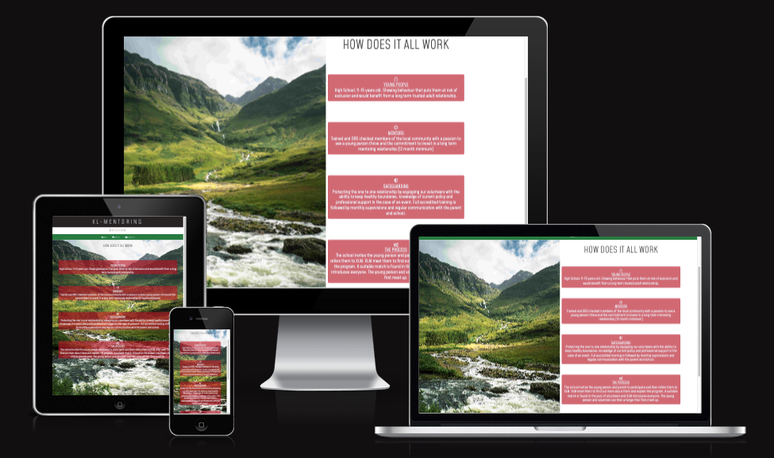

# XL-Mentoring-Wrexham - Testing

-----

## Contents

- [XL-Mentoring-Wrexham - Testing](#xl-mentoring-wrexham---testing)
  - [Contents](#contents)
  - [Automated Testing](#automated-testing)
    - [W3C Validator](#w3c-validator)
    - [Lighthouse](#lighthouse)
  - [Manual Testing](#manual-testing)
    - [Testing User Stories](#testing-user-stories)
      - [First Time Visitor Goals](#first-time-visitor-goals)
      - [Returning Visitor Goals](#returning-visitor-goals)
      - [Frequent User Goals](#frequent-user-goals)
    - [Full Testing](#full-testing)
  - [Bugs](#bugs)
    - [Solved Bugs](#solved-bugs)
    - [Known Bus](#known-bus)

-----

## Automated Testing

This automated testing section contains all testing that has been run through a program to produce validation and performance insights.

### W3C Validator

[W3C](https://validator.w3.org/#validate_by_input) was used to validate all HTML and CSS for the site via direct input. Each individual page was tested and final reconfiguration was carried out to ensure all results produced no errors.

Document checker result from each page

CSS Stylesheets

All HTML and CSS tested through the validator returned no errors or warnings.

### Lighthouse

The lighthouse tool within the chrome developer tools has been used to test performance, best practices, accessibility, and SEO. Desktop and mobile tests have been run for each page.

Home Page Desktop Results

Home Page Mobile Results

About Us Page Desktop Results

About Us Page Mobile Results

Contact Us Page Desktop Results

 Contact Us Page Mobile Results

The images I've used have slowed the websites perfomance. Images have been resized and compressed but there is room for improvement. Future versions of the site may require revisiting some of these issues to improve performance scores.

[*Back to top*](#contents)

------

## Manual Testing

### Testing User Stories

#### First Time Visitor Goals

> * As a first time visitor, I want to be able to easily understand the purpose of the website and to learn more about the charity.

The home page of the site serves the purpose of introducing the charity and giving positive testimonies that have resulted in young people using the charity for first time visitors to listen and read.

> * As a first time visitor, I want to be able to easily navigate the site to access content without having to use the back button at any time.
> 

The site has a clear and easy to follow nav bar that stays at the top of each page

> - As a first time visitor, I want to learn about how the charity works, who it is for, how I can get involved and what safeguarding is in place.
>

The site has a clear about us page with a tower of concise information that isn't too wordy and aimed at all demographics, hoping it covers the essential information for parents, teachers and volunteers.

> - As a first time visitor, I want to learn about the charities details, the founding charity and what involvement has the charity got in the city by viewing its socail media platform.

There is a link to one social media platform, a link to the founding charities website and the charities registration number in the footer,  which stays at the bottom of the screen on each page.

#### Returning Visitor Goals

> * As a returning visitor, I want to know how to contact the charity for more information on how to get involved.

Users can easily find the contact page from the navigation bar. All the form field have to be filled in to enable the form to be submitted. A Formdump reponse has been added to ensure the users form has been recieved

#### Frequent User Goals

> * As a frequent user, I want to be able to navigate the site easily to show teachers, parents, pupils and future voulunteers.

Future adverts for training programmes will be added for users to know training is on-going and taken seriously

### Full Testing

Full testing was performed on the following devices:

* Laptop
  * Imac Retina 21.5 inch screen

* Mobile
* Apple Iphone 11
 
 Desktop device tested the site using the following browsers:
 
* Google Chrome
* Microsoft Edge
* Mozilla Firefox
* Opera
* Safari

Additional testing has been carried out by friends and colleagues including Google Pixel 7 and a Amazon Kids tablet.

------

## Bugs

### Solved Bugs

| # | Issue | Details | What was done | Fixed? |
| --- | --- | --- | --- | --- |
| 1 | Home page further testimonies were not alligned | When viewing the further testimonies page on different screen the boxes wouldn't allign correctly| Had to alter the bootstrap grid system settings | __YES__ |
| 2 | The Pdf link on the home page was enabled so wherever you clicked on the whole page it opened up the Pdf | Missing closing tag on the pdf a | element | __Yes__ |

Screenshot to show how Issue 1 looked on smaller screens

### Known Bus

There are currently no known bugs in this version of the site. However I would like to spend some time on addressing some gaps on the pages when viewing on larger screens 

[*Back to top*](#contents)

-----